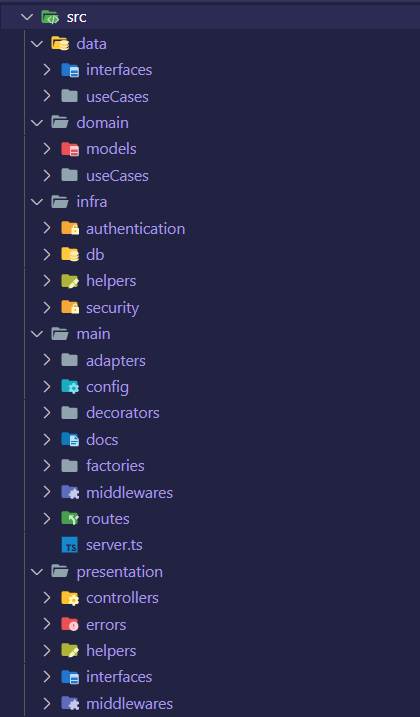

# NodeJS Budget Manager API
### API para gerenciamento e controle de gastos mensais.
A API foi criada seguindo os principios de TDD, SOLID o máximo possível, Clean Architeture e Clean Code o máximo possível, a idéia era manter todo o código desacoplado afim de facilitar manutenção e prover legibilidade e coesão do código. 

---
## 🤔 Problema

Sérgio é um desenvolvedor Frontend e está trabalhando em um projeto pessoal para ajudá-lo a controlar suas finanças e precisa da sua ajuda. Sérgio tem problema com seus gastos. Durante o mês ele gasta mais do que deveria e por isso resolveu criar uma aplicação web que ajude-o a ter um melhor controle financeiro.

---

## 🚀 Escopo 

Para ajudar Sérgio a desenvolver seu projeto, ele precisa que você elabore um backend que ele possa consumir para finalizar o seu sistema.

---

## 🔎 Casos de Uso
- ✅ Autenticação e acesso à plataforma.
- ✅ Criação de orçamento mensal.
- ✅ Registro de gastos.
- ✅ Visualização de gastos.
- ⬜ Atualização de gasto.

Para conseguir seguir o seu orçamento de gastos Sérgio poderá compartilhar o seu progresso com outros usuários e para isso precisará dos seguintes recursos:

- ✅ Enviar convite de acompanhamento para usuários já cadastrados na plataforma.
- ⬜ Cancelar um convite.
- ⬜ Aprovar uma solicitação de convite.
- ⬜ Rejeitar um solicitação de convite.
- ⬜ Visualizar convites recebidos.
- ⬜ Visualizar convites enviados.

**Obs.:** Um convidado deve **apenas poder <u>visualizar</u>** o progresso do orçamento mensal.

---
## ✅ Extras Task List

- ✅ Documentação em Swagger.
- ✅ Docker.
## 👁️ Cobertura de Testes
A descrição da cobertura de testes está disponível em [TESTS](TESTS.md)

## 🗂️ Estrutura de Pastas

## 🧱 Tecnologias utilizadas

- Node.js com Typescript.
- Firestore para persistência de dados.
- Testes automatizados com Jest.
- Arquitetura REST.
- Swagger Documentation.
- Docker.
- Husky para lint-staged.

## 💻 Setup de Desenvolvimento
Para setup de desenvolvimento basta fazer seguir os passos a seguir:
1. Clone do repositório.
2. Executar `npm install`
3. Copiar a chave do Firestore para ./keys
4. Executar `npm run dev`

## 🔍 Testes
- Testes de unidade com `npm run test:unit`
- Testes de integração com `npm run test:integration`
- Para gerar o coverage execute `npm run test:coverage`

## 🚀 Build de Produção (docker)
Execute `npm run up`

